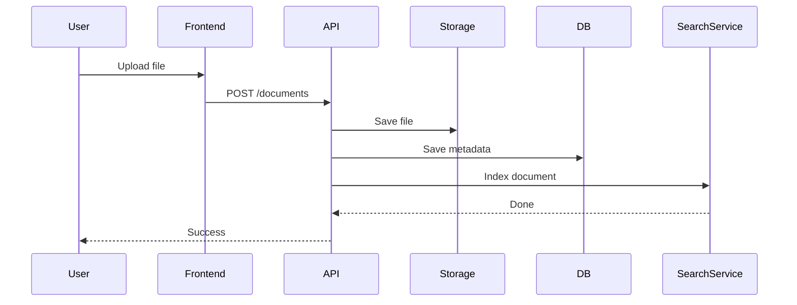

## Implementation Plan: Use Case & Sequence Diagrams for Document Management System

### Task Type

- [x] Documentation (→ Mermaid)

### Technical Solution

Sử dụng **Mermaid.js** để tạo các sơ đồ trực quan ngay trong tài liệu, giúp đội ngũ kỹ thuật và người dùng (IT Intern/Admin) dễ dàng hình dung quy trình.

#### 1. Use Case Diagram (Sơ đồ ca sử dụng)

Xác định các Actors và chức năng chính:

- **Actors**: IT Intern (Người dùng chính), IT Admin (Quản trị hệ thống).
- **Key Use Cases**:
  - Đăng nhập/Phân quyền.
  - Quản lý thư mục (Tạo/Sửa/Xóa).
  - Tải lên tài liệu (Centralized Upload).
  - Tìm kiếm tài liệu nhanh (Fast Search).
  - Quản lý phiên bản (Version Control).
  - Xem lịch sử hoạt động (Audit Log).

#### 2. Sequence Diagram (Sơ đồ trình tự)

Mô tả chi tiết luồng dữ liệu cho chức năng phức tạp nhất: **"Tải lên phiên bản mới và cập nhật chỉ mục tìm kiếm"**.

- Luồng: User -> UI -> Backend Service -> DB (Metadata) -> Storage (Physical File) -> Search Service (Indexing).

### Implementation Steps

1. **Draft Use Case Diagram** - Xác định các mối quan hệ `include` và `extend`.
2. **Draft Sequence Diagram** - Xác định các lifeline và message flow.
3. **Mermaid Integration** - Viết mã Mermaid vào file tài liệu.
4. **Validation** - Kiểm tra tính logic của các sơ đồ so với Tech Stack đã chọn.

### Key Files

| File               | Operation | Description                                   |
| ------------------ | --------- | --------------------------------------------- |
| `docs/diagrams.md` | Create    | Chứa toàn bộ mã Mermaid cho các sơ đồ.        |
| `docs/README.md`   | Update    | Nhúng các sơ đồ vào tài liệu hướng dẫn chung. |

### Mermaid Snippets (Pseudo-code)

#### Use Case

```mermaid
useCaseDiagram
    actor "IT Intern" as Intern
    actor "IT Admin" as Admin
    Intern --> (Search Documents)
    Intern --> (Upload Document)
    Admin --> (Manage Users)
    ...
```

#### Sequence



### SESSION_ID (Simulated)

- CODEX_SESSION: manage_doc_diag_be
- GEMINI_SESSION: manage_doc_diag_fe
