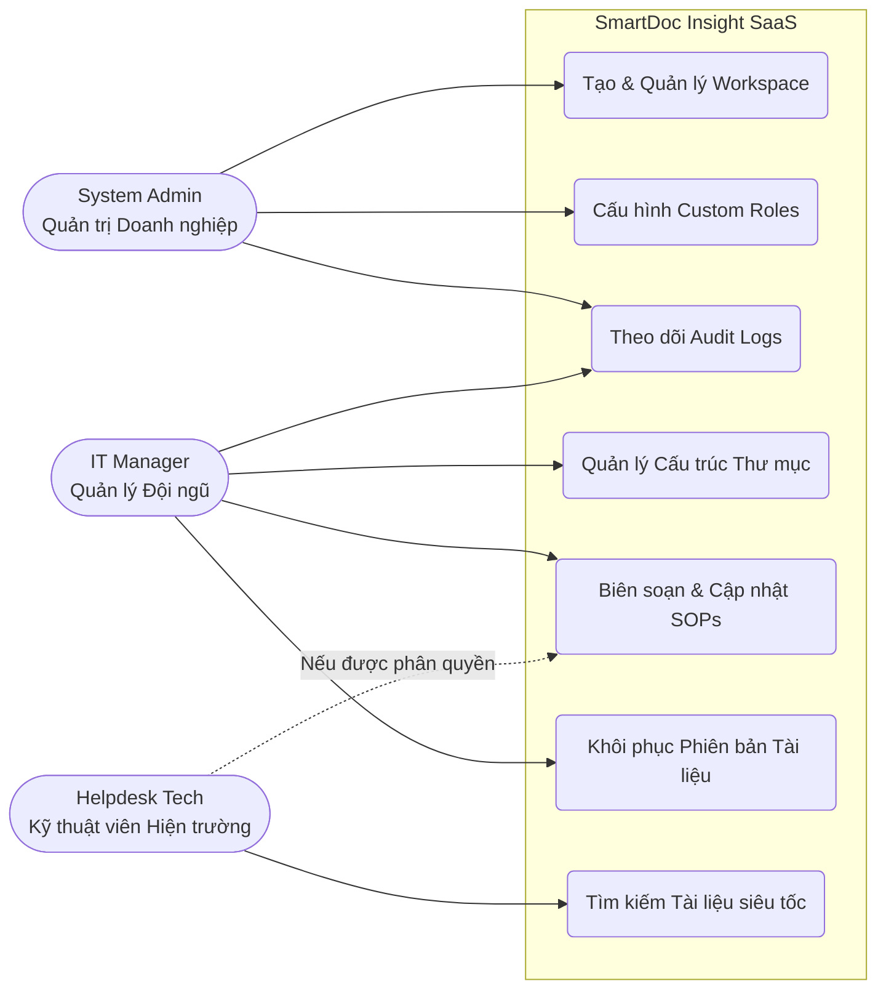

# Chapter 1: Giới thiệu & Mục tiêu Hệ thống

## 1.1 Bài toán đặt ra
Trong môi trường doanh nghiệp hiện đại, đặc biệt là tại các phòng ban hỗ trợ công nghệ thông tin (IT Helpdesk / IT Support), khối lượng tri thức bao gồm tài liệu hướng dẫn (SOPs), quy trình xử lý sự cố (troubleshooting), và các chính sách kỹ thuật nội bộ luôn gia tăng theo cấp số nhân. Việc sử dụng các giải pháp lưu trữ file truyền thống như Google Drive, OneDrive hay thậm chí là các thư mục chia sẻ cục bộ (Shared Folders) ngày càng bộc lộ những hạn chế nghiêm trọng:

- **Thiếu cơ chế phân quyền (RBAC) chi tiết:** Các nền tảng lưu trữ chung thường chỉ hỗ trợ phân quyền ở mức cơ bản (View/Edit). Điều này không đáp ứng được nhu cầu của một tổ chức IT, nơi cần sự phân cấp rõ ràng (ví dụ: IT L1 chỉ được xem tài liệu sự cố thông thường, trong khi System Admin mới có quyền truy cập sơ đồ hạ tầng bảo mật).
- **Trải nghiệm tìm kiếm (Full-text Search) kém:** Khi có hàng ngàn tài liệu, việc một nhân viên IT cần tìm nhanh chóng một đoạn log lỗi hoặc một lệnh xử lý sự cố khẩn cấp trở nên khó khăn. Các công cụ truyền thống thường mất nhiều thời gian để quét nội dung bên trong văn bản hoặc không hỗ trợ tìm kiếm khi sai lỗi chính tả.
- **Không có vết kiểm toán (Audit Trail) minh bạch:** Việc kiểm soát ai đã đọc, tạo mới, chỉnh sửa hay vô tình xóa mất một tài liệu quan trọng là bất khả thi trên các thư mục chia sẻ, gây rủi ro lớn về tính toàn vẹn của tri thức doanh nghiệp.
- **Hạn chế trong mô hình Multi-Tenancy:** Đối với các công ty cung cấp dịch vụ Managed IT Services, họ cần phục vụ nhiều khách hàng (doanh nghiệp) khác nhau. Việc phải tạo ra vô số các thư mục rời rạc cho từng khách hàng mà không có sự cô lập dữ liệu (data isolation) an toàn dễ dẫn đến nguy cơ rò rỉ thông tin chéo.

## 1.2 Giải pháp: SmartDoc Insight
Để giải quyết triệt để những nỗi đau trên, **SmartDoc Insight** ra đời với định vị là một **Hệ thống Quản trị Tri thức tập trung dành riêng cho đội ngũ IT**. Phiên bản 1.0.0 được thiết kế dưới dạng phần mềm dịch vụ (SaaS) cấp doanh nghiệp, mang tới những lợi thế cốt lõi:

- **Tốc độ tìm kiếm tức thời với Meilisearch:** Tích hợp bộ máy tìm kiếm thế hệ mới được viết bằng Rust, SmartDoc Insight mang lại trải nghiệm tìm kiếm "nhanh như chớp" (dưới 50ms). Hệ thống không chỉ quét tiêu đề mà còn quét toàn bộ nội dung tài liệu, đồng thời tự động sửa lỗi chính tả (typo tolerance), giúp kỹ thuật viên tìm ra phương án xử lý sự cố ngay lập tức.
- **Bảo mật và cô lập dữ liệu tuyệt đối (Enterprise Multi-Tenancy):** Kiến trúc hệ thống áp dụng cơ chế cô lập dữ liệu đa người thuê. Mỗi doanh nghiệp tham gia nền tảng sẽ được cấp một "Workspace" hoàn toàn độc lập về mặt logic. Dữ liệu của công ty A sẽ không bao giờ hiển thị ở công ty B, đảm bảo tính bảo mật và sự riêng tư cấp cao nhất.
- **Minh bạch hóa với Audit Logs:** Mọi tương tác của người dùng lên tài liệu hoặc thư mục (Tạo, Sửa, Xóa) đều được hệ thống âm thầm ghi nhận. Ban quản trị có thể truy xuất, theo dõi vòng đời của tài liệu và trích xuất báo cáo (CSV) phục vụ cho mục đích kiểm toán bảo mật.
- **Hệ thống phân quyền động (Dynamic RBAC):** Thay vì bị gò bó bởi các vai trò cứng nhắc, quản trị viên có thể tự do định nghĩa các vai trò mới (Custom Roles) và phân bổ hàng chục quyền hạn (Permissions) chi tiết tới từng thao tác nhỏ nhất, mang lại sự linh hoạt tối đa cho sơ đồ tổ chức của doanh nghiệp.

## 1.3 Phạm vi, Đối tượng sử dụng & Sơ đồ Use Case

Dưới đây là **Sơ đồ Use Case (Tương tác hệ thống)** tổng quan, thể hiện vai trò của từng nhóm người dùng đối với các tính năng lõi:

**Phạm vi dự án (Project Scope) - Phiên bản 1.0.0:**
Hệ thống cung cấp một nền tảng Web Application trọn gói với các tính năng:
- Đăng ký, đăng nhập và gia nhập Workspace qua mã mời (Invite Code).
- Quản lý cây thư mục đệ quy (Recursive Folders) không giới hạn cấp độ.
- Soạn thảo tài liệu, lưu trữ đa phiên bản (Document Versioning).
- Quản lý thành viên, vai trò tùy chỉnh và phân quyền.
- Giao diện Dashboard thống kê số lượng tài liệu, dung lượng và hoạt động gần đây.

**Đối tượng sử dụng (Target Audience):**
- **Nhân viên IT / Kỹ thuật viên (IT Staffs / Helpdesk):** Đối tượng sử dụng chính, cần truy cập nhanh vào kho kiến thức để xử lý ticket và sự cố hàng ngày.
- **Quản lý IT / Trưởng nhóm (IT Managers / Team Leads):** Người chịu trách nhiệm phê duyệt, ban hành các quy trình chuẩn, và quản lý nhân sự trong tổ chức.
- **System Admins / Tổ chức cung cấp dịch vụ IT (MSPs):** Những người quản trị hệ thống, cấp phát không gian làm việc (Workspace) cho khách hàng hoặc các phòng ban nội bộ khác nhau.
