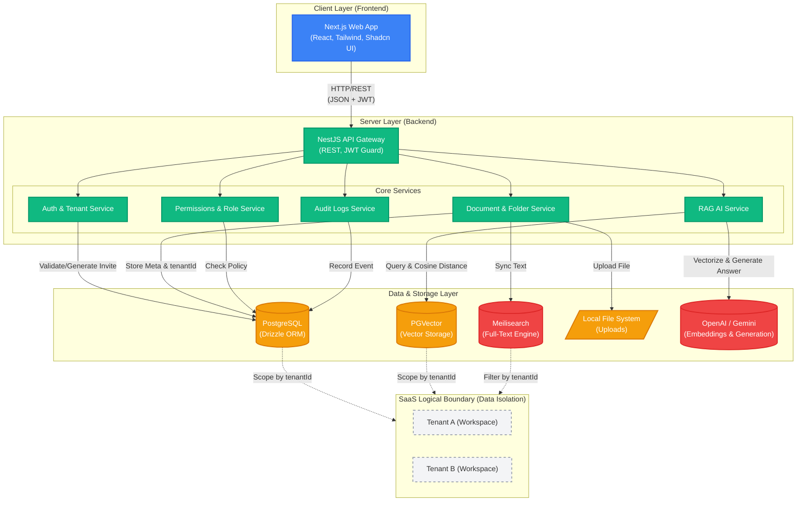

# Chapter 2: Kiến trúc Hệ thống & Technology Stack

## 2.1 Kiến trúc Tổng thể

Dự án SmartDoc Insight áp dụng mô hình Client - Server hiện đại với sự tách biệt rõ ràng giữa các tầng (layers). Kiến trúc này được lựa chọn để tối ưu hóa khả năng mở rộng (scalability) của một hệ thống SaaS đa người thuê (Multi-Tenant), đồng thời cho phép đội ngũ phát triển Frontend và Backend có thể làm việc hoàn toàn độc lập thông qua các API Contracts.

**Luồng dữ liệu (Data Flow) cơ bản:**

1. Client (Browser) gửi request thông qua giao thức HTTP/HTTPS tới Backend API.
2. Backend API xác thực (Authentication) thông qua JWT Token và phân quyền (Authorization) qua Guards/Interceptors để xác định Workspace hiện tại (Tenant ID).
3. Backend xử lý Business Logic và truy vấn xuống Database (PostgreSQL/PGVector) hoặc Search Engine (Meilisearch) tùy thuộc vào tác vụ.
4. Đối với yêu cầu RAG AI Chat, Backend API thực hiện cuộc gọi nhúng (Embedding) tới OpenAI/Gemini, tìm kiếm khoảng cách cosine trên PGVector lọc theo `tenantId`, gửi ngữ cảnh kết hợp tới LLM để sinh câu trả lời có nguồn trích dẫn.
5. Dữ liệu được trả về dưới dạng JSON và Client sẽ đảm nhiệm việc render lên màn hình.

## 2.2 Phân tích Technology Stack

### 2.2.1 Frontend (Client Layer): Next.js 16 & Shadcn/UI

- **Next.js 16 (App Router):** Lựa chọn Next.js mang lại khả năng tối ưu hóa tuyệt vời cho các ứng dụng Web nhờ cơ chế Server-Side Rendering (SSR) và React Server Components (RSC). Việc render HTML trên server trước khi gửi xuống client không chỉ giúp tăng tốc độ tải trang (Fast First Contentful Paint) mà còn tăng tính bảo mật (che giấu API keys).
- **TailwindCSS & Shadcn/UI:** Thay vì tự viết CSS thủ công hay sử dụng các bộ thư viện UI nặng nề, dự án dùng TailwindCSS kết hợp Shadcn/UI. Điều này giúp giao diện giữ được tính đồng nhất (Design System) cực kỳ cao. Các component của Shadcn được copy trực tiếp vào mã nguồn, cho phép tùy chỉnh hoàn toàn (Full Customization) mà không bị phụ thuộc vào thư viện bên thứ ba.

### 2.2.2 Backend (Server Layer): NestJS

- **Clean Architecture & Module-based:** Khác với ExpressJS - nơi cấu trúc thư mục thường lộn xộn, NestJS cung cấp một bộ khung (Framework) vô cùng mạnh mẽ cho Node.js. Mã nguồn Backend được chia thành các Module độc lập (AuthModule, DocumentsModule, TenantsModule...).
- **Dependency Injection (DI):** Tính năng cốt lõi của NestJS giúp loại bỏ việc khởi tạo Object thủ công (`new Service()`). Các Service, Repository được tiêm vào Controller một cách tự động. Điều này giúp mã nguồn lỏng lẻo (Loosely Coupled), cực kỳ dễ dàng cho việc viết Unit Tests và bảo trì khi dự án phình to.

### 2.2.3 Database & ORM (Storage Layer): PostgreSQL, PGVector & Drizzle

- **PostgreSQL & PGVector:** Cơ sở dữ liệu quan hệ mạnh mẽ, ổn định, hỗ trợ rất tốt cho việc lưu trữ cấu trúc cây (đệ quy thư mục) và tính năng JSONB (hỗ trợ phân quyền động). Đặc biệt, hệ thống kích hoạt extension **PGVector** để lưu trữ trực tiếp các chuỗi nhúng (embedding vectors) 1536 chiều của các mảnh tài liệu (document chunks), hỗ trợ tìm kiếm khoảng cách Cosine hiệu năng cao.
- **Drizzle ORM:** Đây là bước ngoặt so với việc sử dụng TypeORM hay Prisma truyền thống. Drizzle là một "Headless TypeScript ORM" cực nhẹ. Nó mang lại Type-safety hoàn hảo: tức là nếu cấu trúc DB thay đổi, Typescript sẽ lập tức báo lỗi ngay lúc viết code (Compile time) thay vì để lọt lỗi khi ứng dụng đang chạy (Runtime error). Điều này đảm bảo tính toàn vẹn dữ liệu tuyệt đối.

### 2.2.4 Search Engine: Meilisearch

- **Tốc độ và tài nguyên:** Trong khi Elasticsearch đòi hỏi một lượng RAM cực lớn (ít nhất 2GB+) để khởi chạy nhờ xây dựng trên Java, thì Meilisearch được viết bằng ngôn ngữ Rust. Nó tiêu thụ cực kỳ ít tài nguyên hệ thống (vài chục MB RAM) mà vẫn duy trì tốc độ phản hồi Instant Search (< 50ms) ngay cả với hàng chục ngàn tài liệu.
- **Typo Tolerance:** Điểm mạnh cực lớn của Meilisearch là khả năng tự động xử lý lỗi đánh máy. Khi kỹ thuật viên IT đang gấp rút xử lý sự cố, việc gõ sai chính tả (ví dụ: gõ "passwrod" thay vì "password") hệ thống vẫn hiểu và trả về đúng tài liệu hướng dẫn cấu hình, nâng cao năng suất xử lý sự cố đáng kể.
