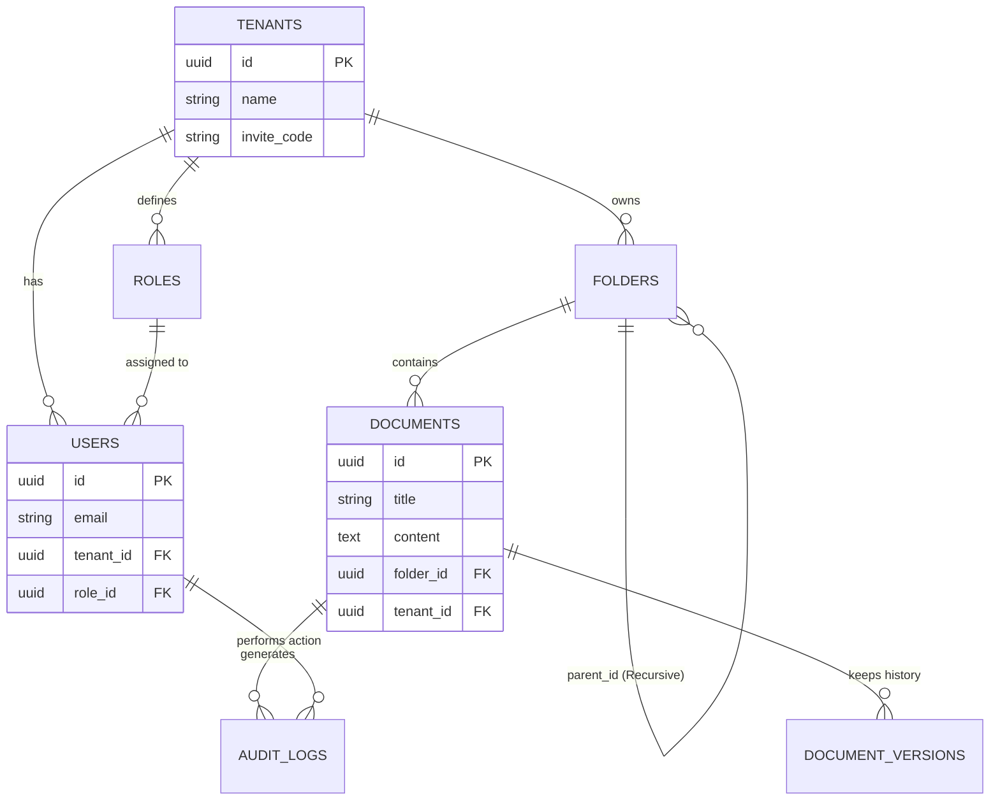

# Chapter 3: Thiết kế Cơ sở Dữ liệu & Chiến lược Đa người thuê (Multi-Tenancy)

## 3.1 Mô hình Đa người thuê (Logical Data Isolation)
Đối với một nền tảng B2B SaaS, kiến trúc Multi-Tenancy (Đa người thuê) là xương sống quyết định sự thành bại. SmartDoc Insight áp dụng mô hình **Shared-Database, Shared-Schema**. 
Nghĩa là tất cả các công ty (Tenants) sử dụng nền tảng đều chia sẻ chung một Database PostgreSQL và dùng chung một Schema cơ sở dữ liệu.

**Tại sao chọn mô hình này cho Phiên bản 1.0.0?**
- **Tiết kiệm chi phí vận hành:** Không cần phải spin-up một Database riêng hay một Schema riêng cho mỗi khách hàng mới đăng ký, giúp tiết kiệm tối đa tài nguyên máy chủ.
- **Bảo trì dễ dàng:** Khi cần thêm một cột mới vào bảng `Documents` (migration), hệ thống chỉ cần chạy lệnh alter table một lần duy nhất, áp dụng ngay lập tức cho tất cả khách hàng.
- Mặc dù dùng chung Database, dữ liệu của các doanh nghiệp vẫn được cô lập hoàn toàn ở mức độ **logic code**.

## 3.2 Quy tắc Ranh giới Bảo mật (Boundary Rules)
Để ngăn chặn tuyệt đối tình trạng rò rỉ dữ liệu (Cross-Tenant Data Leakage), toàn bộ hệ thống tuân thủ chặt chẽ các rào chắn bảo mật vô hình dựa trên `tenantId`:

1. **Khóa ngoại bắt buộc:** Mọi thực thể nghiệp vụ (Users, Roles, Folders, Documents, AuditLogs) đều bắt buộc phải chứa cột `tenantId` (kiểu UUID). Nếu truy vấn thêm mới dữ liệu (INSERT) mà thiếu trường này, Drizzle ORM sẽ lập tức báo lỗi.
2. **Auto-Injection:** Lập trình viên Backend không cần phải viết thủ công mệnh đề `WHERE tenantId = ...` ở mọi nơi. Thay vào đó, một **Global Interceptor** (hoặc Custom Repository) trong NestJS sẽ tự động giải mã JWT Token của người dùng, lấy ra `tenantId` và "tiêm" (inject) nó vào mọi câu lệnh Query xuống Database. 
3. **Tuyệt đối an toàn:** Dữ liệu của Công ty A không bao giờ có thể bị truy cập bởi người dùng của Công ty B, ngay cả khi người dùng B đoán trúng chính xác ID (UUID) của tài liệu. API sẽ luôn luôn trả về lỗi `404 Not Found`.

## 3.3 Luồng Sinh Mã Mời Doanh Nghiệp (Workspace Invite Code)
Thay vì quy trình đăng ký phức tạp (Admin phải nhập email từng nhân viên để gửi link), SmartDoc Insight thiết kế một luồng **Frictionless UX (Trải nghiệm không ma sát)** cho việc gia nhập tổ chức:

- **Bước 1 (Góc nhìn Founder):** Khi một Founder tạo Doanh nghiệp mới (VD: Công ty Tesla), hệ thống sẽ cấp một chuỗi ký tự ngẫu nhiên gồm 6 chữ số (VD: `TSLA99`). Mã này có thể được reset bất cứ lúc nào nếu bị lộ.
- **Bước 2 (Góc nhìn Nhân viên):** Nhân viên mới tải ứng dụng, đăng ký tài khoản cá nhân, sau đó nhập mã `TSLA99` tại màn hình "Join Workspace".
- **Bước 3 (Tự động hóa):** Hệ thống xác thực mã mời, tự động gán tài khoản của nhân viên đó vào `tenantId` của Tesla, và cấp cho họ một Role mặc định (VD: `Guest` hoặc `Member`). Nhân viên ngay lập tức có thể đọc các tài liệu chung của công ty mà không cần Admin phải thao tác thêm.

## 3.4 Bức tranh Toàn cảnh Dữ liệu (Core Data Schema)
Để dễ hình dung cấu trúc lưu trữ, dưới đây là **Sơ đồ Thực thể Liên kết (ERD)** minh họa cách các bảng quan hệ với nhau xoay quanh trục lõi là `Tenants`:

Dưới đây là giải thích chi tiết cho các Domain Entity chính của hệ thống:

- **Bảng `Tenants`:** Bảng cao nhất. Chứa thông tin về doanh nghiệp (Tên công ty, Domain, Invite Code, Settings).
- **Bảng `Users`:** Chứa thông tin đăng nhập của cá nhân. Liên kết `N-1` với `Tenants`.
- **Bảng `Roles` & `Permissions`:** Quản lý cơ chế RBAC động. Mỗi `Tenant` có thể tự tạo các Role riêng (VD: "IT Helpdesk L1") và gán quyền. Liên kết `1-N` với `Users`.
- **Bảng `Folders`:** Lưu trữ cây thư mục đệ quy. Chứa `parentId` trỏ lại chính nó để tạo cấu trúc lồng nhau không giới hạn. Liên kết `N-1` với `Tenants`.
- **Bảng `Documents`:** Lưu trữ bài viết, nội dung. Chứa `folderId` và `tenantId`. Liên kết `N-1` với `Tenants`.
- **Bảng `AuditLogs`:** Bảng lịch sử bất biến (Append-only). Ghi lại mọi hành động (Action Type: CREATE, UPDATE, DELETE) kèm theo ID của người thực hiện và mốc thời gian. Liên kết `N-1` với `Tenants`.
