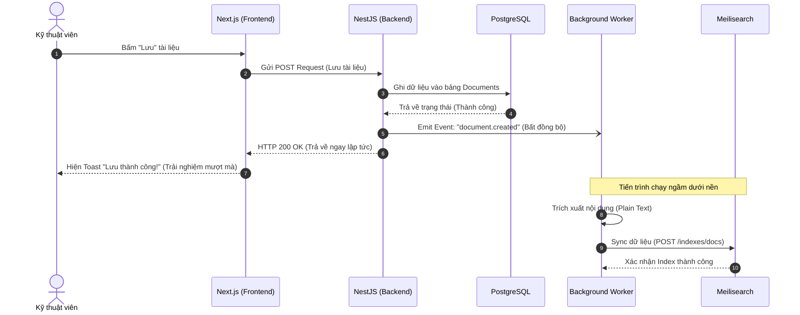
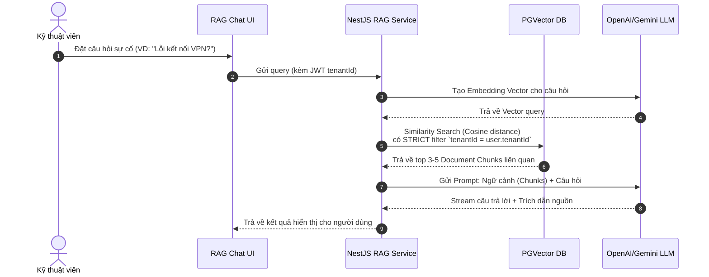

# Chapter 4: Tính năng Lõi & Luồng nghiệp vụ

## 4.1 Hệ thống Phân quyền Động (Dynamic RBAC)

Trong các hệ thống phần mềm truyền thống, các vai trò (Roles) thường được gắn cứng (hard-code) như `Admin`, `Manager`, `User`. Tuy nhiên, với đặc thù của các phòng ban IT, sơ đồ tổ chức phức tạp hơn rất nhiều. SmartDoc Insight giải quyết bài toán này bằng cơ chế **Phân quyền Động (Dynamic Role-Based Access Control)**.

**Luồng nghiệp vụ:**

1. **Tạo Custom Role:** Quản trị viên (Admin) của doanh nghiệp có thể tự tạo ra các vai trò mang tên tùy ý (Ví dụ: `Helpdesk L1`, `Network Engineer`, `Security Auditor`).
2. **Gán Quyền (Permissions):** Admin tick chọn các quyền hạn cụ thể cho từng vai trò trên giao diện (Ví dụ: "Được tạo tài liệu", "Được xóa tài liệu", "Được xem Audit Log"). Hệ thống sử dụng cờ nhị phân (Bitwise) hoặc mảng JSON để lưu trữ các cờ quyền này vào Database.
3. **Thực thi Kiểm duyệt (Authorization):** Khi nhân viên gọi một API (ví dụ: Xóa tài liệu), Request sẽ bị đánh chặn bởi `PermissionsGuard` của NestJS.
   - Guard sẽ giải mã JWT Token để định danh User.
   - Truy vấn vào Database để lấy ra Custom Role của User đó trong Workspace hiện tại.
   - Đối chiếu quyền hạn. Nếu hợp lệ, API được tiếp tục. Nếu không, trả về lỗi `403 Forbidden`.

## 4.2 Cây Thư Mục Đệ Quy & Quản Lý Phiên Bản (Versioning)

### 4.2.1 Cây Thư Mục Đệ Quy (Recursive Folders)

Hệ thống lưu trữ thư mục theo cấu trúc đệ quy vô hạn cấp (n-level) bằng cách sử dụng trường `parentId` tự tham chiếu (Self-referencing). Điều này mang lại trải nghiệm tương tự như Windows Explorer hay Google Drive.

- **Ví dụ Use-case:**
  Doanh nghiệp có thể tạo cấu trúc: `Hạ tầng mạng` ➔ `Firewall` ➔ `Cisco` ➔ `Cisco Firepower 2100`.
  Các tài liệu hướng dẫn sẽ được đặt chính xác vào thư mục con sâu nhất, giúp việc phân loại tri thức trở nên cực kỳ rành mạch.

### 4.2.2 Quản Lý Phiên Bản (Document Versioning)

Tài liệu IT Support thường xuyên phải cập nhật theo sự thay đổi của công nghệ. Để tránh rủi ro mất mát dữ liệu do sai sót của con người, SmartDoc Insight tích hợp tính năng **Document Versioning**.

- **Luồng nghiệp vụ:** Khi một kỹ thuật viên ấn "Lưu" (Save) sau khi chỉnh sửa một tài liệu, hệ thống không ghi đè (overwrite) xóa mất dữ liệu cũ. Thay vào đó, nó tạo ra một **Snapshot (Bản sao lưu)** của phiên bản cũ và lưu vào cơ sở dữ liệu.
- **Cứu hộ tài liệu (Rollback):** Nếu phát hiện tài liệu vừa cập nhật bị sai thông số kỹ thuật (ví dụ: gõ sai dải IP Server), Admin có thể xem lại Lịch sử Phiên bản (Version History) và ấn "Khôi phục" (Rollback) về phiên bản của ngày hôm qua.

## 4.3 Đồng bộ hóa Tìm Kiếm (Asynchronous Search Sync)

Điểm nhấn của nền tảng là tốc độ tìm kiếm với Meilisearch. Tuy nhiên, việc đồng bộ dữ liệu từ PostgreSQL sang Meilisearch phải được xử lý khéo léo để không làm chậm trải nghiệm của người dùng. Hệ thống áp dụng **Cơ chế Bất đồng bộ (Event-Driven Background Task)**.

Dưới đây là **Sơ đồ Tuần tự (Sequence Diagram)** mô phỏng quá trình này:

**Kịch bản diễn giải:**

1. Kỹ thuật viên hoàn tất việc viết một tài liệu hướng dẫn mới và nhấn "Publish".
2. Hệ thống lưu tài liệu vào **PostgreSQL** thành công.
3. API lập tức trả về kết quả `200 OK` cho Frontend để giao diện cập nhật ngay lập tức. Trải nghiệm người dùng hoàn toàn không bị gián đoạn.
4. Song song đó, Backend ngầm phát ra một **Event** (Sự kiện).
5. Một **Background Worker** (Tác vụ chạy ngầm) bắt được Event này, tiến hành trích xuất nội dung thuần (Plain Text) của tài liệu và đẩy sang **Meilisearch**.
6. Chỉ vài trăm mili-giây sau, tài liệu mới đã có thể được tìm thấy qua thanh công cụ tìm kiếm toàn cục (Global Search) của hệ thống.

## 4.4 Trợ lý thông minh RAG AI Chatbot

Tính năng đột phá của SmartDoc Insight là tích hợp AI để trả lời các câu hỏi kỹ thuật thay vì bắt người dùng phải tự tìm và đọc thủ công. Hệ thống áp dụng kiến trúc **RAG (Retrieval-Augmented Generation)**.

### 4.4.1 Quy trình Xử lý Tài liệu (Document Processing)

Khi tài liệu mới (Word, PDF) được tải lên:

- Hệ thống sử dụng thư viện **Mammoth** để đọc file `.docx` và **pdf-parse** để đọc `.pdf`.
- Tài liệu được chia nhỏ thành các đoạn (chunks) sử dụng **LangChain Text Splitters** để bảo toàn ngữ cảnh.
- Mỗi chunk được nhúng (Embedding) thành Vector 1536 chiều bằng **OpenAI/Gemini Embeddings** và lưu vào bảng `document_chunks` trên **PGVector**, gắn kèm `tenantId` để cách ly dữ liệu.

### 4.4.2 Luồng Hỏi Đáp (Question-Answering Flow)

Khi kỹ thuật viên đặt câu hỏi trên Chatbot:

