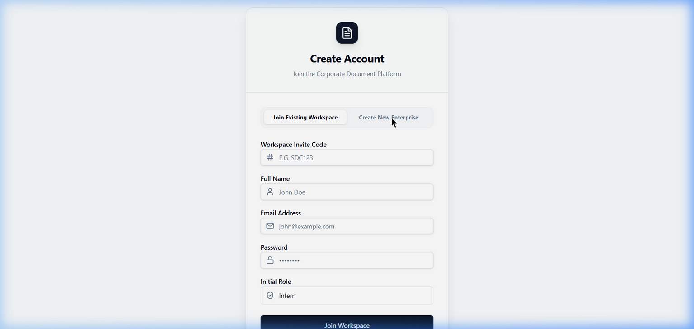
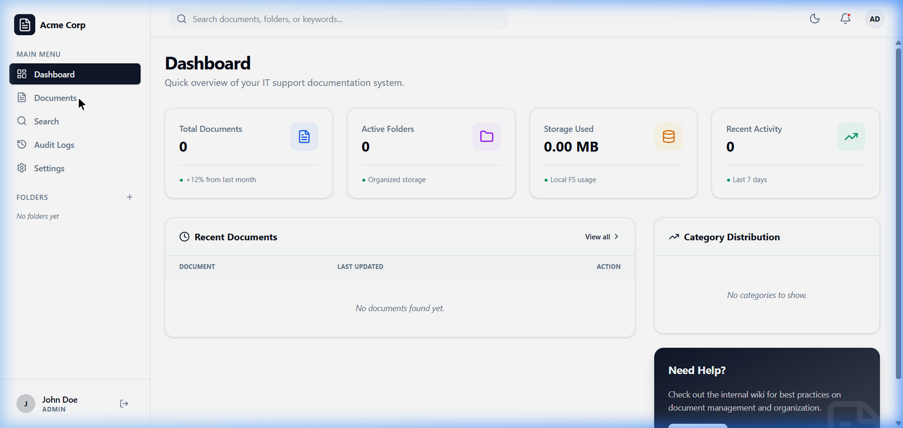
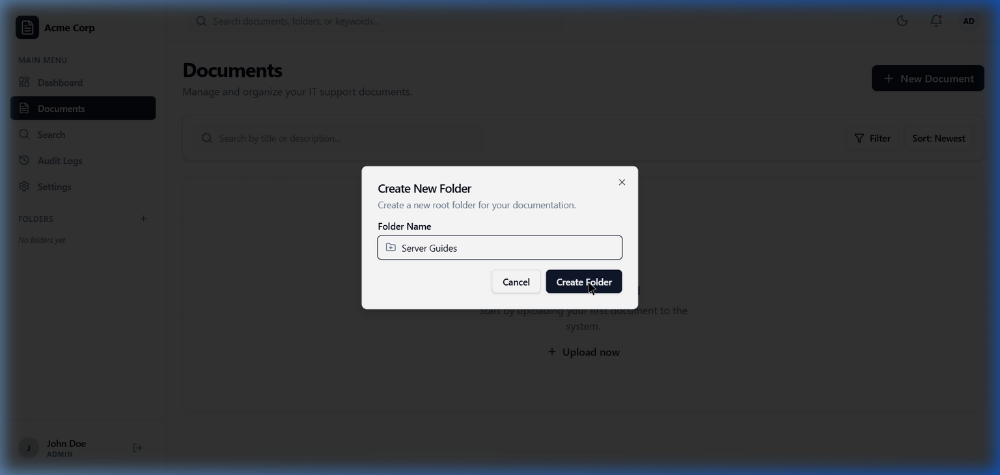
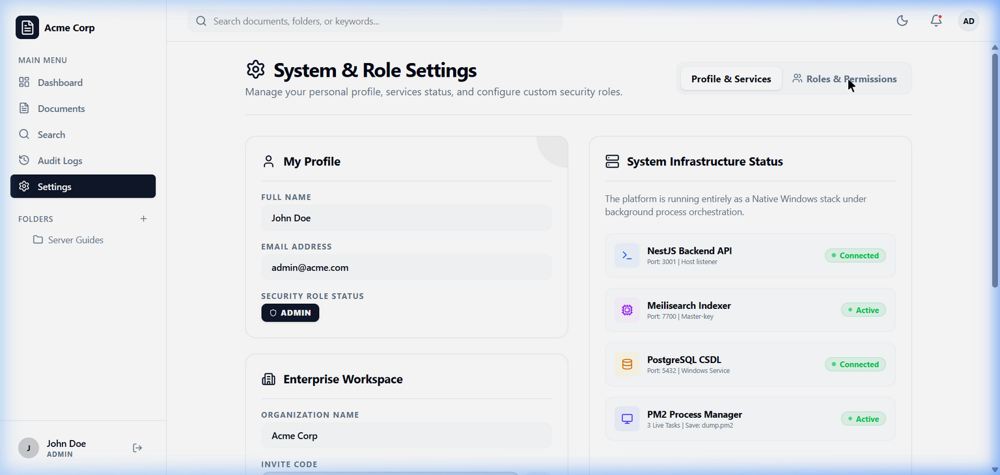

# Chapter 5: Giao diện & Trải nghiệm Người dùng (UI/UX)

## 5.1 Ngôn ngữ thiết kế (Design Language)

Với định vị là một nền tảng B2B SaaS dành cho khối doanh nghiệp, SmartDoc Insight lựa chọn phong cách thiết kế **Modern Minimalist (Tối giản hiện đại)** kết hợp với **Glassmorphism (Hiệu ứng kính)**.

- **Tại sao lại là Glassmorphism?** Các thành phần như Sidebar, Header, và Cards được phủ một lớp nền mờ (backdrop-blur) tinh tế. Điều này không chỉ giúp phần mềm trông cao cấp (premium) mà còn tạo cảm giác không gian có chiều sâu, giúp người dùng tập trung hơn vào vùng nội dung văn bản chính mà không bị rối mắt.
- **Dark Mode Native:** Nhắm tới tệp người dùng chính là lập trình viên và kỹ thuật viên IT (những người thường xuyên làm việc trong môi trường thiếu sáng hoặc ưa thích màn hình tối để bảo vệ mắt), hệ thống được thiết kế với Dark Mode làm mặc định. Các tông màu than, xám đậm kết hợp với các điểm nhấn (Accent colors) tương phản cao mang lại sự chuyên nghiệp tuyệt đối.

## 5.2 Trải nghiệm vi mô (Micro-interactions)

Một ứng dụng Web hiện đại khác biệt với website truyền thống ở chỗ: mọi thao tác đều phải mang lại cảm giác phản hồi ngay lập tức.

- **Framer Motion:** Các thao tác như mở Modal tạo thư mục, chuyển trang, hoặc mở rộng danh sách tài liệu đều đi kèm với các hiệu ứng chuyển động mượt mà (Ease-in, Ease-out). Việc này giúp não bộ người dùng dễ dàng định hình được luồng thay đổi của giao diện.
- **Sonner Toast:** Khi người dùng thực hiện các hành động quan trọng (như Copy mã Invite Code, Lưu cấu hình, Đăng nhập thành công), một thông báo Toast nhỏ sẽ trượt lên ở góc màn hình. Nó mang tính chất xác nhận (Feedback) nhanh gọn mà không làm gián đoạn luồng công việc.

## 5.3 Tính Thích ứng (Responsive Design)

Giao diện của SmartDoc Insight được xây dựng theo triết lý Mobile-First bằng **TailwindCSS**.

- **Desktop View:** Dành cho Admin và Quản lý IT khi họ soạn thảo các SOPs dài, cấu hình phân quyền phức tạp. Giao diện trải rộng tối đa để tận dụng không gian.
- **Mobile/Tablet View:** Đặc biệt hữu ích cho kỹ thuật viên Helpdesk (Field Engineers). Khi họ đang chui dưới gầm bàn sửa dây mạng hoặc ở trong phòng Server không có Laptop, họ hoàn toàn có thể dùng điện thoại mở SmartDoc Insight để tra cứu sơ đồ mạng. Hệ thống tự động thu gọn Sidebar thành Hamburger Menu, và phóng to cỡ chữ để dễ đọc nhất.

## 5.4 Giao diện Demo Thực Tế (Screenshots)

Dưới đây là các hình ảnh chụp trực tiếp từ môi trường hoạt động thực tế của phần mềm (Phiên bản 1.0.0), minh họa cho luồng thao tác của người dùng:

**Bước 1: Khởi tạo Workspace mới (Enterprise)**

_(Giao diện tạo tài khoản và khởi tạo không gian làm việc Đa người thuê - Multi-Tenant)_

**Bước 2: Giao diện Quản trị (Dashboard)**

_(Giao diện tổng quan với ngôn ngữ thiết kế Glassmorphism)_

**Bước 3: Quản lý Thư mục (Recursive Folders)**

_(Modal tạo thư mục mới với hiệu ứng xuất hiện mượt mà từ Framer Motion)_

**Bước 4: Cấu hình Phân Quyền (Roles & Permissions)**

_(Giao diện quản lý Custom Roles và gán quyền hạn (Permissions) chi tiết)_

## 5.5 Giao diện RAG AI Chatbot

Tính năng Chatbot được thiết kế hòa hợp với ngôn ngữ Glassmorphism tổng thể:

- **Floating Chat Assistant:** Khởi chạy từ một nút Sidebar hoặc góc màn hình dưới dạng cửa sổ nổi phủ mờ (backdrop-blur) mà không che khuất màn hình chính.
- **Real-time Message Streams:** Ứng dụng Server-Sent Events (SSE) để hiển thị câu trả lời AI dưới dạng gõ chữ theo thời gian thực (typing effect), đem lại cảm giác tự nhiên.
- **Citation Source Cards:** Mọi câu trả lời của AI đều đi kèm với "Thẻ trích dẫn" hiển thị dạng chip. Khi người dùng click vào thẻ này, hệ thống sẽ mở ra một Modal hoặc dẫn tới tài liệu gốc để tham chiếu.
- **Auto-scroll Mechanics:** Cửa sổ chat sẽ tự động cuộn xuống mềm mại theo nhịp phản hồi của AI.
